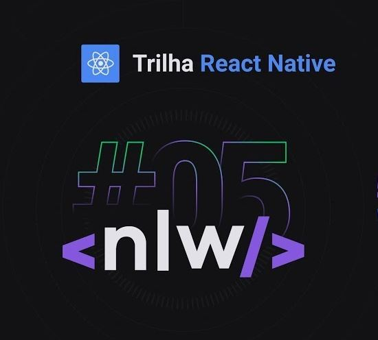
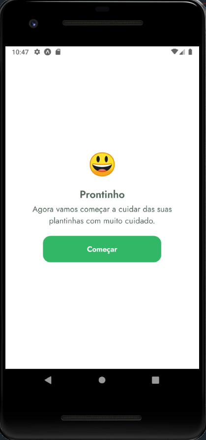
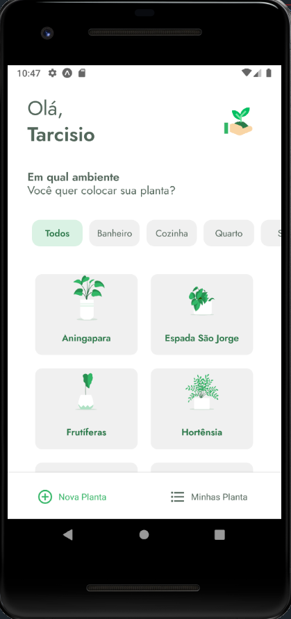
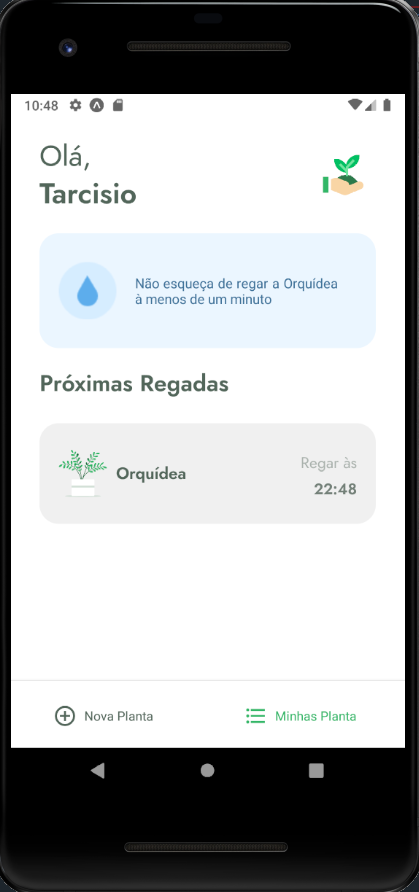
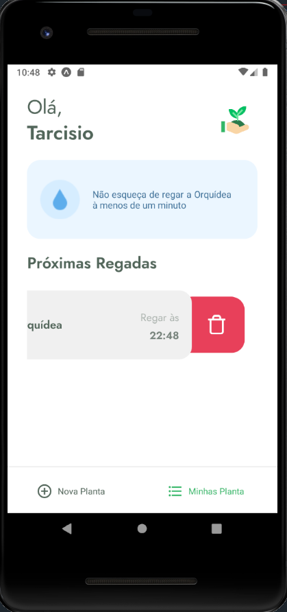
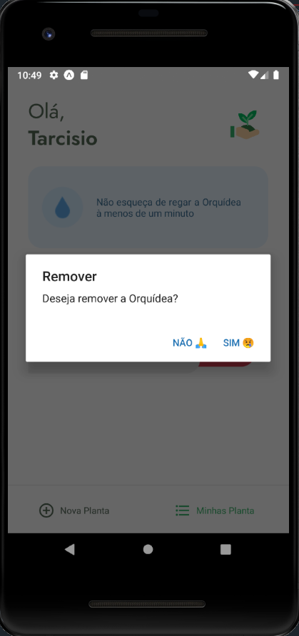

<h1 align="center">
    
</h1>

<h4 align="center"> 
	Next Level Week 3.0 🚀
</h4>


[](https://github.com/tacsio/nlw5/issues)
[](https://github.com/tacsio/nlw5/graphs/contributors)
[](https://github.com/tacsio/nlw5/graphs/commit-activity)


## Figma Layout

[Layout](https://www.notion.so/Trilha-React-Native-525e7888c5d941f5ab8162a200cd2f35)


## :iphone: Plant Manager

- [React Native][reactnative] - React Native combines the best parts of native development with React, a best-in-class JavaScript library for building user interfaces.
- [React Navigation](https://reactnavigation.org/) - Routing and navigation for your React Native apps.
- [Axios][axios] - Promise based HTTP client for the browser and node.js.
- [Expo][expo] - Expo is an open-source platform for making universal native apps for Android, iOS, and the web with JavaScript and React.
- [Expo Font][expo-font] - Allows loading fonts from the web and using them in React Native components. See more detailed usage information in the Using Custom Fonts guide.
- [Expo App Loading][expo-app-loading] - To keep the splash screen visible while the AppLoading component is mounted.
- [Expo Vector Icons][expo-vector-icons] - It includes popular icon sets and you can browse all of the icons using icons.expo.fyi.
- [React Native Iphone X Helper][iphone-x-helper] - A library to help you design your react-native app for notched iPhones.
- [Expo SVG][expo-svg] - Allows you to use SVGs in your app, with support for interactivity and animation.
- [Expo Lottie][expo-lottie] - Support for Lottie, the animation library from AirBnB.
- [Expo Async Storage][expo-async-storage] - An asynchronous, unencrypted, persistent, key-value storage API.
- [Expo DateTime Picker][expo-datatime-picker] - A component that provides access to the system UI for date and time selection.
- [Expo Notification][expo-notification] - Provides an API to fetch push notification tokens and to present, schedule, receive and respond to notifications.
- [Date fns][date-fns] - Modern JavaScript date utility library

#### :hash: Run Scripts

```bash
yarn install
yarn start
# Run on expo
```

<h1 align="center">
    
    
    
    
    
    
    
</h1>

## :bullettrain_side: Contributing

1. Fork it
2. Create your feature branch (`git checkout -b my-new-feature`)
3. Commit your changes (`git commit -am 'Added some feature'`)
4. Push to the branch (`git push origin my-new-feature`)
5. Create new Pull Request

[rocketseat]: https://github.com/rocketseat
[nodejs]: https://nodejs.org
[java11]: https://openjdk.java.net/projects/jdk/11/
[kotlin]: https://kotlinlang.org/
[typescript]: https://www.typescriptlang.org/
[reactjs]: https://reactjs.org/
[reactnative]: https://reactnative.dev/
[quarkus]: http://quarkus.io/
[axios]: https://github.com/axios/axios
[expo]: https://expo.io/
[expo-constants]: https://docs.expo.io/versions/latest/sdk/constants/
[expo-font]: https://docs.expo.io/versions/latest/sdk/font/
[expo-mapview]: https://docs.expo.io/versions/latest/sdk/map-view/
[expo-location]: https://docs.expo.io/versions/latest/sdk/location/
[multer]: https://github.com/expressjs/multer
[celebrate]: https://github.com/arb/celebrate
[yup]: https://github.com/jquense/yup
[knex]: http://knexjs.org/
[react-router-dom]: https://github.com/ReactTraining/react-router#readme
[react-icons]: https://react-icons.github.io/react-icons/
[react-dropzone]: https://react-dropzone.js.org/
[leaflet]: https://leafletjs.com/
[typeorm]: https://typeorm.io/#/
[react-leaflet]: https://react-leaflet.js.org/
[h2]: http://www.h2database.com/html/main.html
[sqlite]: https://www.sqlite.org/index.html
[expo-app-loading]: https://docs.expo.io/versions/latest/sdk/app-loading/
[expo-vector-icons]: https://docs.expo.io/guides/icons/
[iphone-x-helper]: https://github.com/ptelad/react-native-iphone-x-helper
[expo-svg]: https://docs.expo.io/versions/latest/sdk/svg/
[expo-lottie]: https://docs.expo.io/versions/latest/sdk/lottie/
[expo-async-storage]: https://docs.expo.io/versions/latest/sdk/async-storage/
[expo-datatime-picker]: https://docs.expo.io/versions/latest/sdk/date-time-picker/
[date-fns]: https://date-fns.org/
[expo-notification]: https://docs.expo.io/versions/latest/sdk/notifications/